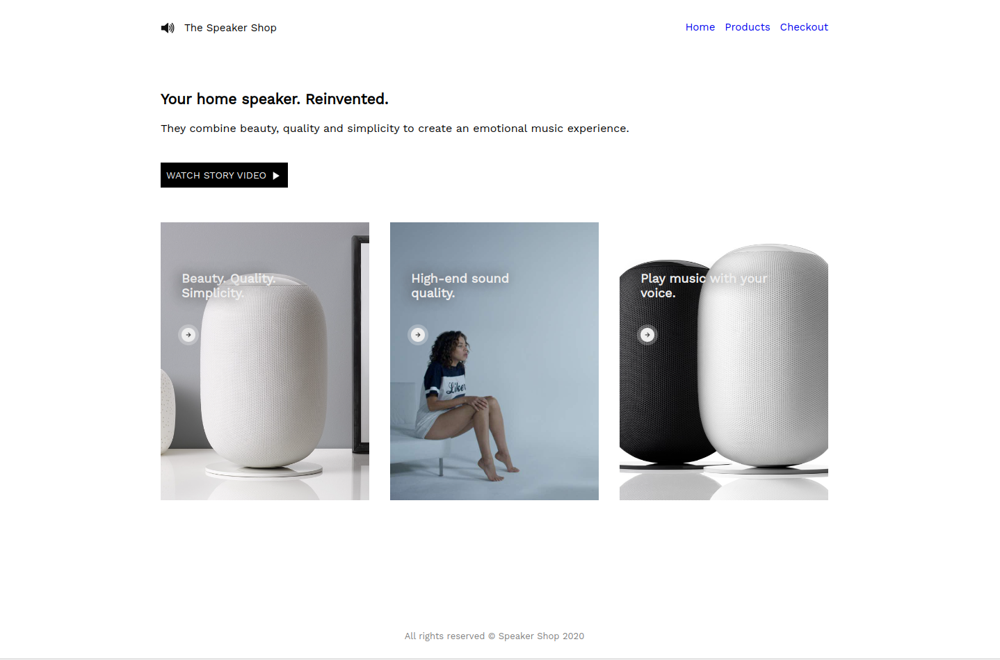

# Homepage eines Lautsprecher-Shops.

Erstelle die Lautsprecher-Shop-Website neu, diesmal unter Verwendung von sass und mixins. Nutze den Boilerplate-Code in der index.html und die Assets im Ordner images.

## Aufgaben

1. Erstelle eine Datei `styles.scss`.
2. Initialisiere eine package.json Datei mit `npm init` und installiere sass als dev dependency.
3. Erstelle das folgende Skript: "compile": "sass styles.scss styles.css --no-source-map --watch".
4. Run das Skript mit dem Befehl "npm run compile".
5. Fang an zu coden! Erstelle die Website wie im Mockup gezeigt.

### Design-Mockup

Schriftart: _Work Sans_ von **Google Fonts**
